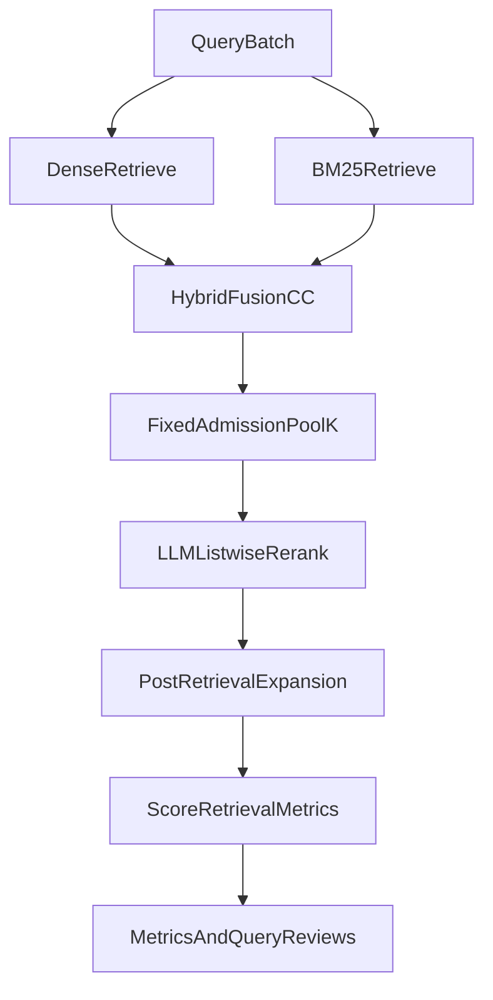

# Architecture: PF2E LLM Reranking Implementation

**Status:** Implemented  
**Scope:** `RulesIngestion` Retrieval Lab pipeline  
**Primary design doc:** `Docs/Design/EXPERIMENT-PF2E-LLM-Reranking.md`

---

## 1. What was added

This implementation adds an **LLM listwise reranker** as a bounded second-stage ranker over a fixed hybrid candidate pool.

The design keeps candidate generation unchanged and inserts an LLM reorder stage before scoring/reporting.

### Core files

- `retrieval_lab/config.py`
- `retrieval_lab/orchestration/cli_parser.py`
- `retrieval_lab/orchestration/cli.py`
- `retrieval_lab/llm_reranker.py`
- `retrieval_lab/orchestration/dense_mode.py`
- `tests/retrieval_lab/test_llm_reranker.py`
- `tests/retrieval_lab/test_config.py`

---

## 2. Architectural position in pipeline

The reranker runs in dense/hybrid orchestration after fusion and before final scoring artifacts.

### R0 / R1 / R2 controls

- **R0:** Hybrid baseline (`retrieval_mode: hybrid`, no rerank)
- **R1:** Existing cross-encoder rerank control (`reranker` set)
- **R2:** LLM listwise rerank treatment (`llm_rerank_enabled: true`)

---

## 3. Config and control surface

New config keys in `ExperimentConfig`:

- `llm_rerank_enabled`
- `llm_rerank_method` (currently `listwise`)
- `llm_rerank_model`
- `llm_rerank_admission_k`
- `llm_rerank_text_char_limit`
- `llm_rerank_prompt_template_id`
- `llm_rerank_max_output_tokens`
- `llm_rerank_cache_dir`

CLI overrides were added for each field in parser + override wiring.

### Validation constraints

When LLM reranking is enabled:

- retrieval mode must be `hybrid` or `hybrid+rerank`
- model must be non-empty
- admission pool must be positive and at least `max(top_k)`
- text and output token limits must be bounded
- prompt template id must be non-empty

---

## 4. LLM reranker module design

`retrieval_lab/llm_reranker.py` provides deterministic listwise reranking with strict guardrails:

1. Builds a bounded candidate payload (`candidate_id`, baseline rank, path, type, excerpt).
2. Uses Responses API with temperature `0`.
3. Requests strict JSON schema with:
   - `ordered_candidate_ids`
   - `rationale_tags` constrained to a fixed vocabulary.
4. Enforces safety post-parse:
   - unknown IDs removed
   - duplicates removed
   - missing IDs appended in deterministic baseline order
   - deterministic fallback to baseline order on invalid JSON.
5. Caches responses by a stable key over:
   - query text
   - candidate payload
   - model id
   - prompt hash/template id.

---

## 5. Diagnostic and artifact model

Per-query `query_reviews` now include `llm_rerank` with:

- candidate pool size
- pre/post top-10 IDs
- required gold IDs found in pool
- required rank before/after
- top-10 crossing booleans
- rerank metadata (`model_id`, `prompt_hash`, `cache_hit`, `fallback_reason`)
- optional rationale tags.

Run-level metrics include `llm_rerank_summary`:

- `query_count`
- `cache_hit_count`
- `fallback_count`

This supports explicit attribution of gains vs no-op/fallback behavior.

---

## 6. Experiment configuration files

Added hybrid configs for direct R0/R1/R2 execution:

- `retrieval_lab/experiments/hybrid/pf2e_multihop_r0_hybrid_baseline.yaml`
- `retrieval_lab/experiments/hybrid/pf2e_multihop_r1_crossencoder_control.yaml`
- `retrieval_lab/experiments/hybrid/pf2e_multihop_r2_llm_listwise.yaml`

These target PF2E multihop benchmark runs with a fixed admission design and comparable retrieval settings.

---

## 7. Observed behavior from first run

The architecture executed end-to-end, but R2 reported `fallback_count == query_count` in run artifacts.  
This means the reranker path worked mechanically, yet semantic ranking lift did not materialize in that run because all listwise outputs fell back to baseline ordering.

### Interpretation

- Integration correctness: **good** (pipeline, artifacts, controls, tests)
- Experimental validity for R2 quality signal: **not yet sufficient** until fallback causes are eliminated

---

## 8. Extension points

Recommended next architectural refinements:

1. Strengthen Responses parsing path for structured output variants.
2. Add explicit parse telemetry (raw format class, parse branch used, schema-failure bucket).
3. Add a tiny replay harness for reranker response fixtures to catch regressions before benchmark runs.
4. Keep cross-encoder control as required baseline comparator for future LLM rerank trials.

---

## 9. Why this architecture is safe

- Fixed-pool reranking prevents retrieval leakage.
- Unknown candidate IDs are rejected.
- Tie-break and fallback behavior are deterministic.
- Artifacts are explicit enough to audit every rerank decision path.
- Control arms (R0, R1) remain available for causal attribution.

