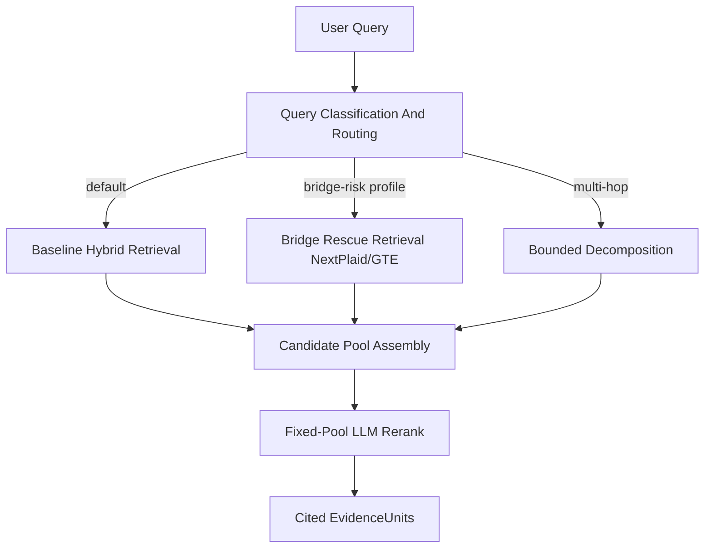

# Architecture: Retrieval Runtime Plane

**Purpose:** Define the tight, simple retrieval runtime path from query to cited EvidenceUnits, codifying proven experimental results and retiring unvalidated knobs.

**Status:** Canonical adjunct.

**Related:** [ARCHITECTURE-RulesIngestion-High-Level.md](ARCHITECTURE-RulesIngestion-High-Level.md) (Retrieval Runtime Plane), [RETRIEVAL_LAB.md](RETRIEVAL_LAB.md), [bounded_multihop_retrieval_design_memo.md](bounded_multihop_retrieval_design_memo.md), [ARCHITECTURE-RERANKING-TOOLING.md](ARCHITECTURE-RERANKING-TOOLING.md), [gold_resolution_design.md](gold_resolution_design.md).

---

## 1. Situation

Retrieval Lab has accumulated many boolean flags and numeric knobs across its experimental lifecycle. Bakeoffs and experiments have produced clear evidence about what works. This document defines the minimal runtime plane that carries forward only validated defaults and a small set of durable levers.

---

## 2. Baseline Runtime Process (with routing)

The retrieval runtime plane uses one baseline process with an explicit routing decision. No rescue heuristics and no flag forest.

### Stage 1: Query Classification and routing

Classify incoming query and apply baseline routing policy. This is the controlled branching point in the baseline runtime process.

- **Default:** single-hop (no decomposition)
- **Multi-hop signals:** enumeration keywords, comparison keywords, "all ... that", "what are the differences between", queries tagged T2/T3 in benchmark
- **Bridge-risk signals:** known first-hop bridge families, historical "gold not in candidates" signatures, or explicit profile tags
- **Implementation:** lightweight heuristic or single LLM classification call (temperature 0, cached)
- **Budget:** 0 or 1 LLM calls

### Stage 2: Baseline Hybrid Retrieval

Retrieve candidates using the validated hybrid CC stack. One path, no mode switches.

- **Fusion:** CC (convex combination), minmax normalization
- **Lambda:** 0.7 (corpus-level override to 0.8 allowed for small corpora)
- **Embedding model:** all-mpnet-base-v2 (default); corpus-specific override via config
- **BM25 budget:** 100 (corpus-level override to 200 for large corpora)
- **Dense budget:** 100
- **No enrichment profiles:** text-only embedding and BM25 indexing

**Evidence:** [REPORT-Hybrid-Bakeoff-2026-03-05-Full.md](../Reports/REPORT-Hybrid-Bakeoff-2026-03-05-Full.md).

### Stage 2b: Routed bridge-rescue retrieval

When Stage 1 routes a query to bridge-rescue, run late-interaction retrieval (NextPlaid/GTE) before pool assembly.

- **Role:** improve first-hop candidate admission on specific query families.
- **Guardrails:** candidate count and latency budgets must remain within the same runtime envelope.
- **Baseline policy state:** enabled by routing policy, not manual ad hoc toggles.
- **Promotion state:** included in baseline process as a routed branch; not a replacement for default multihop path.

Current evidence after scoring-path correction:

- targeted-slice gains are real (PHB5e, SWCR, and one Starfinder rescue case),
- but multihop MRR still trails established E0/E6 baselines on combined PHB and PF2e working-set tracks.

Therefore this branch is baseline-routed by profile/query class, not globally enabled.

### Stage 3: Bounded decomposition (multi-hop only)

When the query is classified as multi-hop, decompose into up to 3 subqueries, retrieve per-subquery, and fuse into the candidate pool.

- **Max subqueries:** 3
- **Decomposition model:** pinned, temperature 0, schema-validated output
- **Per-subquery retrieval:** same hybrid CC stack as baseline
- **Fusion into pool:** stable union with baseline prefix lock (the `only_add` policy in `retrieval_lab/query_enhancement/multi_query.py`)
- **Budget:** max 2 LLM calls (1 for classification, 1 for decomposition)
- **No loops:** one decomposition pass, no recursive search

**Validation:** E0/E6/E7 from [EXPERIMENT-Query-Decomposition.md](../Experiments/EXPERIMENT-Query-Decomposition.md). Decomposition remains off by default until E6 validates.

### Stage 4: Candidate pool assembly

Build a single fixed pool from all retrieval passes. Deterministic dedup by unit_id.

- **Max pool size before rerank:** 40 candidates ([bounded_multihop_retrieval_design_memo.md](bounded_multihop_retrieval_design_memo.md) budgets)
- **Dedup:** by unit_id, keep highest score
- **No uncontrolled post-retrieval expansions:** no sidecars, no free-form co-retrieval loops. Structural context belongs in substrate shaping (Stage B) or Stage C, not in runtime rescue.
- **Allowed exception:** profile-gated dual-list/late-interaction candidate contributions are permitted when explicitly enabled and audited.

### Stage 5: Fixed-pool LLM rerank

Reorder the fixed pool. No new candidates enter. Reranking is a rank-depth lever.

- **Method:** LLM listwise
- **Model:** gpt-5.3-codex (validated in [ARCHITECTURE-RERANKING-TOOLING.md](ARCHITECTURE-RERANKING-TOOLING.md))
- **Admission k:** 20
- **Text char limit:** 900
- **Optional:** disable reranking for latency-sensitive production; baseline retrieval alone is strong on ratified clean subsets

### Output: Cited EvidenceUnits

Return top-k EvidenceUnits with:

- `unit_id`, `text`, `structural_path`, `page_fingerprint`
- retrieval score, retrieval source (baseline / variant / decomposed)
- no graph nodes, no typed rule objects, no interpretation

### Routing policy contract

Baseline routing should be deterministic and auditable:

- `route = default_hybrid | bridge_rescue | multihop_decompose`
- emit `route_reason` per query in run artifacts
- emit `route_policy_version` in manifest/config
- compare routed vs non-routed cohorts on the same scored surface

---

## 3. Validated Defaults (Evidence)

| Setting | Default | Evidence |
|--------|---------|----------|
| Hybrid fusion | CC | [REPORT-Hybrid-Bakeoff-2026-03-05-Full.md](../Reports/REPORT-Hybrid-Bakeoff-2026-03-05-Full.md): RRF consistently worse; CC preserves or improves dense |
| BM25 normalization | minmax | Same report: minmax beats atan in 9/12 model/track comparisons |
| CC lambda | 0.7 | Same report: λ=0.7 best single default; 0.8 for strong models on small corpora |
| Embedding model | all-mpnet-base-v2 | [REPORT-Embedding-Bakeoff-Comprehensive-2026-03-04.md](../Reports/REPORT-Embedding-Bakeoff-Comprehensive-2026-03-04.md); cross-corpus safest default |
| LLM rerank admission_k | 20 | [ARCHITECTURE-RERANKING-TOOLING.md](ARCHITECTURE-RERANKING-TOOLING.md) §6.2: perfect ReqFSH@10 with smallest pool |
| LLM rerank text_char_limit | 900 | Same: best for ReqFSH@10 in sweep |
| Max candidates before rerank | 40 | [bounded_multihop_retrieval_design_memo.md](bounded_multihop_retrieval_design_memo.md) §11 |

---

## 4. Retired Flags and Code Paths

These flags in `retrieval_lab/config.py` (and related code paths) are either disproven by evidence or never promoted. They should be marked legacy or removed.

### Disproven by bakeoff

| Flag / setting | Reason |
|----------------|--------|
| `hybrid_fusion_method: rrf` | CC is validated default; RRF consistently degrades (see hybrid bakeoff reports) |
| `cc_bm25_normalization: atan` | minmax wins 9/12 comparisons |
| `embedding_enrichment_profile` / `bm25_enrichment_profile` | [EXPERIMENT-Embedding-Metadata-Enrichment.md](../Experiments/EXPERIMENT-Embedding-Metadata-Enrichment.md): no gain; baseline text-only is default |

### Never promoted as defaults

- `co_retrieval_expand`
- `clause_family_projection` (as an unconditional runtime retrieval flag)
- `dependency_pairing_expand`
- `crossref_sidecar_expand`
- `two_stage_retrieval`
- `raw_first_merge_rerank`, `raw_merge_score_floor`, `raw_merge_rank_floor`
- `unit_type_boost`
- `expand_context`
- `a_prime_generate_minimal`

### Retained as routed baseline branches (not global defaults)

- `dual_list_fusion` (targeted PHB bridge slices; currently small but real required-full-set@10 gain under guardrails)
- late-interaction NextPlaid/GTE branch (first-hop rescue only; not promoted for multihop defaults)

### Dead code

- `OnlyAddFusionConfig.rerank_union` — documented as not enabled by default, never implemented
- `fuse_union_rerank` fusion mode — can demote baseline, never promoted

After retirement, default retrieval-time booleans reduce to a small set: `llm_rerank_enabled`, `query_enhancement.enabled` (for decomposition), and `hybrid_enabled` (vs dense-only; typically always true). Routed branches such as `dual_list_fusion` and bridge-rescue remain policy-controlled and audited.

---

## 5. Minimal Retained Configuration Surface

**Corpus-level (change per rulebook):**

- `embedding_model`: string (default: all-mpnet-base-v2)
- `cc_lambda`: float (default: 0.7)
- `bm25_budget`: int (default: 100)

**Runtime (change per query class):**

- `llm_rerank_enabled`: bool (default: true for multihop evaluation, false for latency-sensitive production)
- `decomposition_enabled`: bool (default: false until E6 validates)
- `late_interaction_rescue_enabled`: bool (default: true in baseline process only when route=`bridge_rescue`)
- `retrieval_route_policy_version`: string (required for recommendation-grade runs)

**Evaluation (change per experiment):**

- `answer_eval.enabled`: bool
- `auto_gold_review.enabled`: bool

Everything else is a validated default and should not need per-experiment tuning.

**Canonical experiment config:** `retrieval_lab/experiments/retrieval_plane_canonical.yaml` — runnable YAML that sets only retrieval-plane defaults (hybrid CC, no decomposition, no expansions). Override `substrate_path`, `document_id`, and `query_batches` for other corpora.

---

## 6. Production Bridge

The production retriever in DungeonMindServer (`ruleslawyer/hybrid_retriever.py`) should converge toward these validated defaults:

1. **Model migration:** Current bge-m3 is the weakest model by bakeoff. Migrate to all-mpnet-base-v2 for immediate improvement, or pplx-embed-v1-0.6B for best MRR on larger corpora.
2. **Weight alignment:** Production already uses 0.3/0.7 (lexical/semantic), which matches CC lambda=0.7. Correct.
3. **Graph boost:** Production has graph-adjacency-based boosting. Keep as production-only convenience; do not backport into the canonical evaluation path (would confound benchmark comparisons).
4. **Future path:** When decomposition and reranking validate in Retrieval Lab, add them as optional stages in production. Production can skip both for low-latency single-hop queries.
5. **NextPlaid usage policy:** Keep as an optional rescue branch for bridge-like first-hop failures. Do not replace the multihop default path with NextPlaid until it clears E0/E6-style multihop gates on combined surfaces.

---

## 7. Validation Plan (Before Promoting Decomposition)

Before promoting decomposition to the default runtime path, run in order:

1. **E0 baseline on PHB 5e multihop** — establish baseline without decomposition
2. **E6 decomposition on PHB 5e multihop** — measure parent-to-microbundle coverage gain
3. **E7 decomposition + rerank on PHB 5e multihop** — measure combined effect
4. **SWCR deep dive** — investigate why SWCR broad is only MRR=0.2868 on a clean benchmark (retrieval problem, not benchmark debt)

Only after E0/E6/E7 results are in should decomposition be promoted to the default runtime path.

Latest run outcome (2026-03-17): E0/E6/E7 gates on PHB5e multihop are **not passed**; decomposition is **not promoted** and default remains off for this surface. See `Docs/Experiments/EXPERIMENT-Query-Decomposition.md` for run IDs and deltas.

---

## 8. References

- [bounded_multihop_retrieval_design_memo.md](bounded_multihop_retrieval_design_memo.md) — controller budgets, operator vocabulary, trace schema
- [ARCHITECTURE-RERANKING-TOOLING.md](ARCHITECTURE-RERANKING-TOOLING.md) — reranker placement, config, baseline/delta semantics
- [EXPERIMENT-Query-Decomposition.md](../Experiments/EXPERIMENT-Query-Decomposition.md) — E0/E6/E7 rungs and gates
- [gold_resolution_design.md](gold_resolution_design.md) — benchmark projection and contract validation
