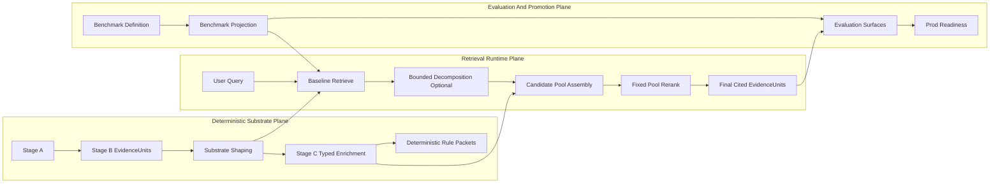

# RulesIngestion High-Level Architecture

**Purpose:** Define the high-level target architecture for RulesIngestion now that Stage A/B contracts are established and Retrieval Lab has produced strong evidence about which retrieval levers matter.

**Status:** Canonical adjunct.

**Related:** [README.md](README.md), [ARCHITECTURE-Retrieval-Runtime-Plane.md](ARCHITECTURE-Retrieval-Runtime-Plane.md), [RETRIEVAL_LAB.md](RETRIEVAL_LAB.md), [gold_resolution_design.md](gold_resolution_design.md), [bounded_multihop_retrieval_design_memo.md](bounded_multihop_retrieval_design_memo.md), [ARCHITECTURE-TOC-Structural-Enrichment.md](ARCHITECTURE-TOC-Structural-Enrichment.md).

**Historical references (archived):** [archive/v1/architecture_overview.md](archive/v1/architecture_overview.md), [archive/v1/stage_a_contract.md](archive/v1/stage_a_contract.md), [archive/v1/stage_b_contract.md](archive/v1/stage_b_contract.md), [archive/v1/gates_stage_c_d.md](archive/v1/gates_stage_c_d.md)

---

## 1. Design Goal

RulesIngestion should optimize for one outcome:

- produce a deterministic, provenance-safe evidence substrate;
- retrieve the smallest sufficient set of cited `EvidenceUnit`s for a query;
- and derive typed rule packets from those cited units that can later hydrate a deterministic game engine.

This means the architecture should stay simple in the runtime path and strict in the substrate path.

---

## 2. Non-Negotiable Invariants

These invariants come from the Stage A/B and Retrieval Lab contracts and should remain true even as retrieval changes:

1. **`EvidenceUnit` is the only admissible evidence layer.**
   All downstream facts, answers, and future typed rule outputs must resolve back to one or more cited `EvidenceUnit`s.
2. **Stage A and Stage B remain non-semantic.**
   Stage A reconstructs authorial surface. Stage B binds admissible evidence. Neither stage becomes an interpretation, ontology, or graph layer.
3. **Retrieval-only structures remain non-authoritative.**
   Clause families, context windows, sidecars, typed expansion indices, and future graph-like structures may help retrieval, but they are never citable on their own.
4. **Determinism is a first-class architecture property.**
   The same inputs and config must reproduce the same substrate, rankings, benchmark projections, and typed outputs.
5. **Evaluation is contract-aware and surface-aware.**
   Retrieval claims are valid only relative to one exact corpus contract, one benchmark projection, and one named evaluation surface.
6. **Stage C cannot mutate canonical evidence.**
   It may derive typed artifacts from `EvidenceUnit`s, but it cannot redefine the admissible substrate.

---

## 3. Three-Plane Architecture

### Plane responsibilities

- **Deterministic substrate plane:** build and preserve the citable truth layer plus any shaped or typed derivatives.
- **Retrieval runtime plane:** solve the user query with the smallest set of bounded, evidence-producing runtime operations.
- **Evaluation and promotion plane:** ensure every retrieval claim is tied to an exact corpus contract and benchmark surface.

---

## 4. Deterministic Substrate Plane

### Stage A

Stage A exists to reconstruct the authored surface with high fidelity:

- page-scoped structure;
- deterministic ordering;
- tables, lists, headings, and prose preserved as authored;
- no semantics, ontology, or paraphrase.

### Stage B

Stage B exists to bind the authored surface into admissible evidence:

- stable `EvidenceUnit` identity;
- provenance fields;
- ordering and containment;
- complete tables and lists;
- auditable joins only.

### Substrate shaping

Substrate shaping is allowed when it improves structural quality without violating admissibility:

- fold and merge shaping;
- TOC-derived structural repair;
- benchmark-safe chunk recipe changes;
- other explicit, auditable shaping steps.

Any shaping that changes corpus identity must trigger benchmark re-projection and contract validation.

### Stage C

Stage C should be narrow and typed. Its role is not to become a general retrieval graph. Its role is to derive deterministic, schema-valid rule structure such as:

- progression linkage;
- base and exception linkage;
- row-to-definition linkage;
- level gating;
- option-family membership;
- other typed rule relations that support deterministic engine hydration.

The key test for Stage C is:

> Would this typed artifact still be worth building if retrieval improved tomorrow?

If the answer is no, it is probably retrieval compensation, not architecture.

---

## 5. Retrieval Runtime Plane

The runtime path should stay small and explicit.

### Recommended runtime stack

1. **Baseline retrieval**
   Retrieve from the shaped Stage B substrate using the current contract-valid dense, BM25, or hybrid stack.
2. **Baseline routing decision**
   Apply deterministic query routing in the baseline process. Bridge-risk profiles run a late-interaction branch (NextPlaid/GTE) for first-hop rescue; non-bridge queries stay on default hybrid.
3. **Bounded decomposition when needed**
   Use decomposition mainly for multi-hop or bounded-enumeration queries where candidate generation is the bottleneck.
4. **Candidate pool assembly**
   Build one fixed pool from baseline retrieval plus approved bounded expansions.
5. **Fixed-pool reranking**
   Use reranking as a rank-depth lever, not as hidden retrieval.
6. **Return final cited `EvidenceUnit`s**
   The runtime output is still evidence, not a graph node or a typed rule object.

### Runtime design bias

The architecture should prefer:

- stronger bounded model steps;
- fewer runtime operators;
- explicit query classes for decomposition;
- fixed-pool reranking;
- route-controlled retriever branches only when they show first-hop gains under guardrails;
- simple structural context fetches where justified.

The architecture should be skeptical of:

- growing retrieval-only pseudo-graphs;
- benchmark-shaped controller branches;
- many interacting rescue heuristics;
- runtime systems that solve interpretation in retrieval rather than in post-retrieval reasoning.
- replacing the multihop default path based only on targeted first-hop improvements.

---

## 6. Evaluation And Promotion Plane

Retrieval Lab remains the system's evaluation and promotion harness, not its truth layer.

It should continue to own:

- corpus contract materialization;
- benchmark definition versus projection separation;
- surface-aware scoring;
- promotion via `prod_readiness.json`;
- optional answer evaluation against retrieved context only.

This means high-level architecture decisions should always be reviewable through three questions:

1. What exact corpus contract does this run depend on?
2. What benchmark projection and surface is being scored?
3. Does this improve retrieval, answer quality, or both?

If the answer is unclear, the architecture is drifting.

---

## 7. Minimal Long-Term Levers

Given the current design docs and retrieval evidence, the smallest durable set of levers looks like this:

- **Substrate quality:** chunking, fold/merge, and TOC-style structural repair.
- **Baseline retrieval mode:** dense, BM25, or hybrid with contract-aware comparison.
- **Bounded decomposition:** a model-driven candidate-generation lever for hard multi-hop queries.
- **Fixed-pool reranking:** a model-driven rank-depth lever.
- **Targeted late-interaction rescue:** a baseline-routed first-hop bridge lever (for example NextPlaid/GTE) governed by explicit routing policy, not a universal default.
- **Typed Stage C outputs:** offline deterministic rule structure that is useful beyond retrieval.
- **Answer evaluation:** optional, Retrieval-Lab-native, surface-aware validation of end-to-end grounded behavior.

Everything else should justify itself against this simpler core.

---

## 8. What This Architecture Is Not

This target architecture is:

- not graph-first;
- not open-ended agentic retrieval first;
- not a generic query-enhancement platform;
- not a justification for making Retrieval Lab's experimental control surface the permanent runtime design.

It is instead:

- substrate-first;
- evidence-first;
- decomposition-aware;
- rerank-aware;
- and Stage-C-for-hydration, not Stage-C-for-retrieval-rescue.

---

## 9. Practical Direction

If future work follows this architecture, the next major design bets should be:

1. keep Stage A/B stable and strict;
2. keep shaping auditable and contract-aware;
3. simplify the retrieval runtime around baseline retrieval, bounded decomposition, fixed-pool reranking, and only narrow profile-gated rescue branches;
4. build Stage C only where it produces deterministic typed rule packets that a game engine can actually use.

That gives RulesIngestion a cleaner long-term shape:

- canonical evidence stays small, deterministic, and citable;
- runtime retrieval stays bounded;
- and the project's real semantic investment moves into typed rule extraction that can support deterministic game-engine hydration.
