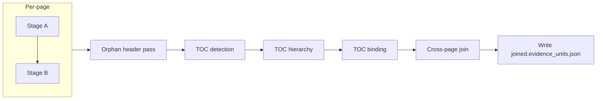

# TOC-Anchored Structural Enrichment — Technical Architecture

**Purpose:** Describe the Mark III **Table-of-Contents (TOC) structural enrichment** pipeline: how book-level section structure is derived from the TOC, how it is used to enrich `structural_path` on EvidenceUnits, and how this fits into the Stage A/B flow and retrieval guarantees.

**Status:** Implemented (Mark III).  
**Related:** [v1/architecture_overview.md](v1/architecture_overview.md), [v1/stage_b_contract.md](v1/stage_b_contract.md), [v1/schema_registry.md](v1/schema_registry.md).

---

## 1. Problem Statement

EvidenceUnit `structural_path` is built **per-page** from the SurfaceAST: only markdown headings (`#`, `##`, …) contribute. This leads to:

- **Orphan units:** Content that is not under a markdown heading on its page gets `structural_path: []` and `anomaly_flags: ["no_heading_parent"]`. Examples: table titles emitted as plain text by OCR, continuation pages of a section that has no heading on that page.
- **Shallow paths:** Most units have depth-1 paths (single heading); multi-level hierarchy is rare because the AST is page-scoped.
- **Retrieval impact:** Structurally detached units (e.g. the Cleric Advancement Table on a page with no "CLERIC" heading) are harder for structure-aware retrieval and clause-family heuristics to admit, and can cause "gold not in candidates" for queries that expect the table under the CLERIC section.

The **root cause** is that structural context is not carried across page breaks and is not anchored to a **book-level** notion of sections. The Table of Contents provides that anchor.

---

## 2. Strategy Overview

1. **Detect** the TOC on early pages (deterministic pattern scoring; optional LLM fallback).
2. **Extract** flat TOC entries (title + page number) and **reconstruct** a hierarchical tree (LLM-assisted, with strict validation).
3. **Bind** every EvidenceUnit to the deepest TOC section whose page range contains the unit’s page, and set `structural_path` to that section’s ancestry. Optionally bind **table captions** (short preceding prose) into `join_metadata.table_title`.

This is **enrichment**: it updates `structural_path` (and related fields) on Stage B units before the cross-page join. The original path is preserved in `join_metadata.original_structural_path` and the source of the path is flagged (`toc_structural_path`). Stage A’s AST is unchanged.

---

## 3. Pipeline Position

TOC enrichment runs **after** the per-page Stage A+B and the **orphan header pass**, and **before** the **cross-page join** pass.

- **Orphan header pass:** LLM-assigned heading for pages with no headings (existing).
- **TOC detection:** Scan pages 0..12 for TOC pattern; emit flat entries.
- **TOC hierarchy:** LLM reconstructs parent/child from flat entries; validate 1:1 against flat list; fallback to flat tree if validation fails.
- **TOC binding:** For each page dir, load Stage B units, map `page_fingerprint` → page index, assign TOC-derived `structural_path`, optionally bind table captions; write updated `stageB.evidence_units.json` and `toc_bindings.json`.
- **Cross-page join:** Reads the enriched per-page Stage B artifacts; produces `joined.evidence_units.json`.

All TOC logic lives in `extraction/toc_parser.py` and `extraction/toc_binder.py`. Orchestration is in `scripts/run_mark3_full_pdf.py`.

---

## 4. Phase 1: TOC Detection and Flat Entry Extraction

**Module:** `extraction/toc_parser.py`

- **Input:** Per-page `stageA.page.json` (and optionally `stageA.surface.ast.json`) for pages 0..12.
- **Scoring (per page):**
  - Heading text matches `TABLE OF CONTENTS` / `CONTENTS` (casefold) → +0.5
  - Line pattern `Title ..... N` or `Title — N` with entry-density ratio ≥ 0.4 → +0.3
  - Page numbers in extracted entries monotonically non-decreasing → +0.2
- **Threshold:** Score ≥ 0.7 → TOC found. Best-scoring page(s) used for entry extraction.
- **Flat entry regex:** `^(.+?)\s*\.{3,}\s*(\d+)\s*$` and `^(.+?)\s*[—–-]+\s*(\d+)\s*$` → `TocEntry(title, page_num, raw_line)`.
- **Fallback:** If no page scores ≥ 0.7, a `##TODO` hook exists to pass the first ~10 pages to an LLM to locate the TOC (not implemented in initial release).

**Artifacts:** `toc_detection.json` (score, candidate_pages, confidence, method, entry_count), `toc_entries.json` (flat list of entries).

---

## 5. Phase 2: TOC Hierarchy Reconstruction

**Module:** `extraction/toc_parser.py`

- **Input:** Flat `TocEntry` list from Phase 1.
- **Process:** Flat list is sent to a mini/nano LLM with instructions to output the same entries in hierarchical form using indentation (e.g. 2 spaces per level). Response is parsed into (depth, title, page_num); depth is derived from leading whitespace.
- **Validation (strict):**
  - Every line in the LLM output must map 1:1 to a flat entry (title + page_num).
  - No extra or missing entries; no duplicate entries.
  - If validation fails, **fallback:** treat all entries as top-level nodes (flat tree).
- **Data model:** `TocNode(title, page_num, page_end, depth, children)`. `page_end` is computed in Phase 3.

**Artifact:** `toc_tree.json` (hierarchy_method, nodes as tree, node_count, top_level_count).

---

## 6. Phase 3: Unit Binding (Structural Path Enrichment)

**Module:** `extraction/toc_binder.py`

- **Page-range computation:** For each `TocNode`, `page_end` = next sibling’s `page_num - 1`, or parent’s `page_end` for last child, or `total_pages - 1` for last top-level. This yields a contiguous `[page_num, page_end]` range per section.
- **Fingerprint → page index:** Built by scanning `stageA.page.json` in each page dir; `page_fingerprint` → `page_index`.
- **Binding rule:** For each EvidenceUnit, resolve its `page_fingerprint` to `page_index`; find the **deepest** TOC node whose range contains that page; set `structural_path` to the ancestry path from root to that node (e.g. `["Player Guide", "Choose a Character Class", "Cleric"]`). If the unit already had a non-empty path, the last segment can be preserved when it is not already in the TOC path (e.g. keep a per-page heading as leaf).
- **Metadata:** `join_metadata.original_structural_path` = previous path; `join_metadata.toc_bound` = True; add `toc_structural_path` to `anomaly_flags`; remove `no_heading_parent` when a TOC path is assigned.
- **Unit ID:** Recomputed after path change: `blake3(text + "|" + structural_path_joined)` so identity reflects the new path.
- **Table caption binding (same pass):** If a unit has `unit_type == "table"` and the immediately preceding unit on the **same page** is short prose (e.g. &lt; 80 chars) and not a table, store that prose in `join_metadata.table_title`.

Binding is applied **in-place** to each page dir’s `stageB.evidence_units.json`; then `toc_bindings.json` is written at the eval root with per-unit binding records for audit.

---

## 7. Artifacts Summary

| Artifact | Location | Description |
|----------|----------|-------------|
| `toc_detection.json` | Eval root | Detection result: found, score, toc_pages, method, entry_count, confidence. |
| `toc_entries.json` | Eval root | Flat list of TocEntry (title, page_num, raw_line). |
| `toc_tree.json` | Eval root | Hierarchical tree (nodes with page_num, page_end, depth, children). |
| `toc_bindings.json` | Eval root | Binding summary + per-unit records (unit_id, status, page_index, original_path, toc_path, table_title when applicable). |
| `stageB.evidence_units.json` | Per-page dir | **Updated in place** with TOC-derived structural_path and table_title. |

---

## 8. Gates and Diagnostics

**Module:** `extraction/gates_b.py`

- **gate_toc_binding_coverage:** Fraction of (joined) units that have `toc_structural_path` in anomaly_flags. Warn if &lt; 80%, fail if &lt; 50%.
- **gate_orphan_after_toc:** Fraction of units with empty `structural_path` after TOC binding. Warn if &gt; 5%, fail if &gt; 15%. Expect near zero except for front-matter/index.

These gates run on the **joined** corpus after the join pass and are included in the evaluation report and join manifest.

---

## 9. Contract and Schema Alignment

- **Stage B contract:** EvidenceUnits remain the admissible layer. TOC enrichment only updates `structural_path`, `anomaly_flags`, `join_metadata`, and `unit_id` (recomputed). No change to Stage A or to the rule that “headings are absorbed” in Stage B; TOC runs after Stage B and adds a second, auditable source of path.
- **Auditability:** `original_structural_path` and `toc_structural_path` flag make it clear when and how the path was set. `toc_bindings.json` supports forensic checks.
- **Identity:** `unit_id` is recomputed when `structural_path` changes, so the same text under different TOC sections gets different IDs. **Collision risk:** Identical text + empty path on different pages (e.g. image placeholders ``) can still produce the same `unit_id` before TOC; after TOC, differing page→section binding can yield different paths and thus different unit_ids. Any global dedupe by `unit_id` alone remains risky; see schema_registry and Stage B contract for multi-field identity recommendations.

---

## 10. Expected Impact (Design Targets)

- Orphan rate (empty `structural_path`) reduced from ~8.5% to near 0% (excluding front-matter/index).
- Median structural path depth increased (e.g. from 1 to 2–4 with hierarchy).
- Unique paths collapse toward the number of real book sections (~50) rather than hundreds of shallow variants.
- Benchmark queries whose gold units were orphaned (e.g. Cleric Advancement Table) get gold under a proper section path (e.g. `["Player Guide", "Choose a Character Class", "Cleric"]`) and `table_title` where applicable, improving fairness of “gold in candidates” metrics.

### 10.1 How structural_path affects gold-in-ranking

Retrieval Lab metrics treat "gold in candidates" as: at least one **required** gold unit_id appears in the **top-k retrieved list**, either as a chunk id or inside a chunk's `source_unit_ids` (merged chunks). The following is how `structural_path` (and thus TOC enrichment) affects whether gold gets into that ranking.

1. **Merge grouping (`merge_units_by_heading`)**  
   Chunks are built from EvidenceUnits grouped by `(page, structural_path)` (see `retrieval_lab/substrate_loader.py`: `_structural_path_key`).  
   - **Empty path (orphans):** Key becomes `(page, "__orphan__" + unit_id)`, so the unit is **never merged** with others. The gold unit is a standalone chunk; it appears in the ranking only if BM25/dense return that chunk in top-k.  
   - **Non-empty path:** Units that share the same `(page, structural_path)` are merged (subject to max_chars and table boundaries). Tables are always emitted as standalone chunks. So gold that is **prose** can sit inside a merged chunk; "gold in candidates" then requires that merged chunk to be in top-k (the merged chunk's `source_unit_ids` are used for gold matching in metrics).

2. **Gold resolution and corpus identity**  
   TOC binding **recomputes `unit_id`** when `structural_path` changes. If the benchmark's gold IDs were produced against a **pre-TOC** corpus, those IDs are not present in a **post-TOC** substrate. Gold will then fail to resolve (grounding) or never match in metrics. So benchmarks must be **re-grounded on the same corpus version** (enriched) used for retrieval when measuring "gold in candidates."

3. **Parent-fetch (structure-based expansion)**  
   `parent_fetch.py` uses `structural_path` to add parent/sibling context to retrieval candidates for downstream use (e.g. LLM context). It **does not** change the set of chunk IDs used for **metrics**: "gold in candidates" and recall@k are computed on the **raw** top-k ranked chunk list. So today, parent-fetch does not add gold into the candidate set for metric purposes. With TOC enrichment, orphan gold gets a real path; if a future pipeline counted expanded (parent-fetched) context toward "gold in candidates," that gold could then count when added as a sibling of another hit in the same section.

**Summary:** TOC enrichment does not change BM25/dense scores (same text). It changes (a) whether gold is merged with other section content or stays standalone, (b) that gold has a section path so it can be found as a sibling in structure-based expansion, and (c) that gold must be re-grounded to enriched unit_ids for metrics to be valid.

---

## 11. References

- [v1/architecture_overview.md](v1/architecture_overview.md) — Stage A/B and Retrieval Lab placement.
- [v1/stage_b_contract.md](v1/stage_b_contract.md) — EvidenceUnit, gates, structural_path semantics.
- [v1/stage_a_contract.md](v1/stage_a_contract.md) — SurfaceAST, no structural change from TOC.
- [v1/schema_registry.md](v1/schema_registry.md) — EvidenceUnit schema, join_metadata, source_unit_ids.
- [ADR-003](v1/adr/ADR-003.md) — Clause families as retrieval-only projections; structural_path feeds into structure-aware retrieval.
