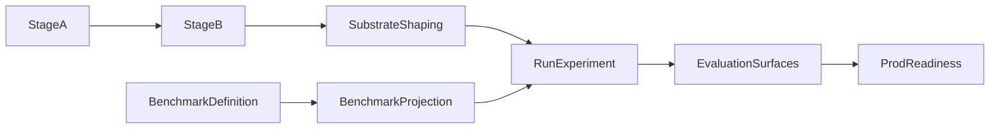

# Retrieval Lab — Current Architecture

**Purpose:** Describe the current Retrieval Lab architecture as implemented today: where it sits in the RulesIngestion pipeline, how runs are configured and scored, what artifacts recommendation-grade runs emit, and which surfaces are authoritative for downstream promotion and comparison.
**Status:** Implemented and current.
**Related:** [README.md](README.md), [ARCHITECTURE-RulesIngestion-High-Level.md](ARCHITECTURE-RulesIngestion-High-Level.md), [ARCHITECTURE-Retrieval-Runtime-Plane.md](ARCHITECTURE-Retrieval-Runtime-Plane.md), [gold_resolution_design.md](gold_resolution_design.md), [ARCHITECTURE-TOC-Structural-Enrichment.md](ARCHITECTURE-TOC-Structural-Enrichment.md), [ARCHITECTURE-RERANKING-TOOLING.md](ARCHITECTURE-RERANKING-TOOLING.md).
**Canonical note:** This top-level document is the current Retrieval Lab architecture reference for the live system.
**Historical runbook reference (archived):** [archive/v1/retrieval_lab_v1.md](archive/v1/retrieval_lab_v1.md), [archive/v1/baseline_manifest.md](archive/v1/baseline_manifest.md), [archive/v1/schema_registry.md](archive/v1/schema_registry.md), [archive/v1/architecture_overview.md](archive/v1/architecture_overview.md).

---

## 1. Scope

Retrieval Lab is the evaluation and recommendation layer that runs over a shaped Stage B substrate and a benchmark definition/projection. Its core job is still retrieval measurement: discoverability of benchmark evidence under a configured retrieval regime.

What has changed is the breadth of the implemented harness:

- Retrieval Lab now orchestrates dense, BM25, and hybrid retrieval runs.
- It validates benchmark projection contracts against the active corpus contract before recommendation-grade promotion.
- It partitions benchmark scoring into explicit evaluation surfaces rather than assuming a single unlabeled active output.
- It can optionally run LLM-backed auto-gold review and answer evaluation inside the same experiment flow.

Those optional LLM-assisted stages do not change the basic architectural boundary: Retrieval Lab remains a harness around corpus identity, benchmark projection, retrieval scoring, and promotion artifacts.

---

## 2. Position in the pipeline

Retrieval Lab consumes a shaped substrate, not raw extraction output. The retrieval corpus identity is downstream of Stage A/B and any shaping or enrichment that changes the effective corpus contract.

Important implications:

- Retrieval Lab metrics are only meaningful relative to one exact corpus contract.
- Substrate-shaping changes such as fold/merge, chunking changes, or structural enrichment can change corpus identity and therefore require benchmark re-projection.
- The benchmark definition is not the same thing as the scored benchmark artifact inside a run directory; the scored artifact is a projection against one exact corpus contract.

For the benchmark definition/projection lifecycle, see [gold_resolution_design.md](gold_resolution_design.md).

---

## 3. Current retrieval lifecycle

The implemented run lifecycle is:

1. **Load config**
   - YAML under `retrieval_lab/experiments/`
   - typed into `ExperimentConfig`
2. **Establish corpus contract**
   - build or reuse corpus embeddings and `embeddings/corpus_index.json`
   - preserve `corpus_fingerprint`, `corpus_content_fingerprint`, `corpus_index_sha256`, and `corpus_recipe`
3. **Resolve benchmark against the active corpus**
   - load the benchmark definition
   - validate or materialize a projection for this exact corpus contract
4. **Run retrieval**
   - dense, BM25, or hybrid
   - optional retrieval-time expansion/rerank features may apply
5. **Score explicit evaluation surfaces**
   - always score `full_working_set`
   - always score `clean_subset`
   - optionally add `pre_review_manual` and `post_review_applied`
6. **Emit recommendation artifacts**
   - per-surface metrics and per-query outputs
   - contracts and manifests
   - `prod_readiness.json` selecting the recommendation-grade surface

This means Retrieval Lab is no longer just “run a retriever and dump metrics.” It is a contract-aware experiment harness with explicit corpus identity and promotion semantics.

---

## 4. Current modes and defaults

Retrieval Lab currently supports three primary retrieval modes:

- **Dense:** embedding-based retrieval over the active shaped substrate
- **BM25:** sparse retrieval without an embedding step
- **Hybrid:** dense plus BM25 fusion inside the experiment flow

Retrieval Lab baseline now includes a **routing step** that can send bridge-risk queries through a late-interaction retriever branch (NextPlaid/GTE) before candidate fusion.

The most important current default is:

- **Hybrid fusion now defaults to convex combination (`cc`)**
- **RRF remains supported, but as an explicit comparison/legacy mode**
- **NextPlaid/GTE is baseline-routed for bridge-risk query profiles; it is not the global default for all queries**

That is a material change from older docs and historical experiment notes that framed hybrid as RRF-first.

### Current happy path

For recommendation-grade hybrid work, the current architectural direction is:

- shape the substrate first
- reuse embeddings when the corpus contract is unchanged
- run hybrid with the validated CC defaults
- compare only contract-valid runs
- promote from `prod_readiness.json`, not from an informal run name

### 4.1 2026-03 scoring correction and policy update

The previously observed "zero MRR" failure mode in targeted NextPlaid bakeoffs was traced to a scoring-path bug, not retriever collapse. After correction:

- PHB5e clean-subset MRR improved from `0.5875` (benchmark baseline) to `0.7437` (NextPlaid), with required-gold hit rate reaching `97.4%` by top-20 and `100%` by top-50.
- Starfinder improved from `0.6162` to `0.6446`.
- SWCR improved from `0.2868` to `0.6021`.
- Stage 2 dual-list fusion on PHB improved required-full-set@10 from `20/32` to `22/32` while preserving guardrails (~`25 ms` p95, stable candidate budgets).
- A deep diagnostic (`top_k=100` + oracle self-retrieval) showed corpus/query alignment is strong (>=95% oracle hits by top-10), so remaining gaps are not corpus-missingness failures.

At the same time, multihop integration remains weaker than established baselines:

- PHB multihop combined MRR at `0.5614` trails E0 (`0.6195`) and E6 (`0.5937`).
- PF2e working-set MRR at `0.6725` trails baseline (`0.8542`).

**Policy outcome:** Update the baseline process to include route-based bridge rescue for specific first-hop failures; do not promote NextPlaid/GTE as a replacement for the default multihop path.

The stable details of older command syntax and legacy v1 policy are preserved in [archive/v1/retrieval_lab_v1.md](archive/v1/retrieval_lab_v1.md).

---

## 5. Evaluation surfaces and selected truth

Current Retrieval Lab runs are surface-aware by design.

### Standard surfaces

- **`full_working_set`**
  - scores the full current benchmark working set
- **`clean_subset`**
  - scores only the clean ratified-core subset
  - this is the default recommendation-grade surface for promotion

### Optional review surfaces

- **`pre_review_manual`**
  - snapshot of the benchmark before auto-gold application
- **`post_review_applied`**
  - snapshot after auto-gold recommendations are applied and the run is re-scored

### Selection rule

When explicit surfaces exist, downstream consumers should resolve artifacts from:

1. `prod_readiness.json.selected_surface`
2. then `evaluation_surfaces.json` if needed

In current recommendation-grade runs, the selected surface is normally `clean_subset`, not an unlabeled `metrics.json` default.

---

## 6. Ratification, benchmark tracks, and why `clean_subset` exists

The benchmark layer now distinguishes two important tracks:

- **`ratified_core`**
  - intended for stable comparison and recommendation-grade promotion
- **`working_set`**
  - current broader working benchmark population

Retrieval Lab computes ratification summaries and extracts the clean ratified query set into `clean_subset`. This is why the surface model matters:

- `full_working_set` tells you how the broader active benchmark behaves
- `clean_subset` tells you how the ratified recommendation-grade core behaves

This split matters because:

- recommendation artifacts should be based on a clean, contract-valid surface
- comparisons between runs should not silently mix benchmark semantics
- invalid ratified queries are treated as a serious policy problem, not a cosmetic warning

For the detailed benchmark projection lifecycle, see [gold_resolution_design.md](gold_resolution_design.md).

---

## 7. Optional LLM-assisted stages

Two optional subsystems now exist inside the main run path.

### Auto-gold review

Auto-gold review uses retrieved top-k candidates to ask an LLM reviewer for benchmark gold recommendations. When enabled, Retrieval Lab can:

- preserve a `pre_review_manual` surface
- apply recommendations to the in-run benchmark projection
- re-score retrieval on the post-review benchmark
- emit a `post_review_applied` surface and review queue artifacts

### Answer evaluation

Answer evaluation is a separate optional pass that asks an LLM answer generator to answer queries from retrieved evidence and then records answer-level evaluation outputs such as refusal and citation behavior.

These features expand the harness, but they do not replace retrieval scoring as the primary responsibility of the system.

---

## 8. Core artifacts of a recommendation-grade run

Serious runs should be understood through their artifacts, not only by experiment name.

### Corpus and contract artifacts

- `embeddings/corpus_index.json`
- `benchmark_contract_validation.json`
- `benchmark.<surface>.json`
- `benchmark.<surface>.contract.json`

### Reporting artifacts

- `REPORT.md`
- `metrics.<surface>.json`
- `per_query.<surface>.json`
- `failure_buckets.<surface>.json`
- `retrieved_chunks.<surface>.json`
- `evaluation_surfaces.json`

### Reproducibility and promotion artifacts

- `manifest.json`
- `run_manifest.json`
- `embedding_provenance.json`
- `prod_readiness.json`

`prod_readiness.json` is the authoritative answer to:

- which run is promotion-ready
- which surface was selected
- which model and benchmark projection were selected
- which exact corpus contract was used

---

## 9. Architectural boundaries and comparison policy

Several boundaries should be treated as non-negotiable:

- Do not compare runs unless their benchmark surface semantics and corpus contracts are explicit and compatible.
- Do not treat an old benchmark definition as implicitly valid for a newly shaped corpus.
- Do not promote from a run name or an ad hoc metrics file when `prod_readiness.json` is available.
- Do not assume hybrid semantics from old RRF-era notes when the live config defaults are CC-based.
- Do not treat late-interaction wins on targeted first-hop slices as evidence of multihop closure readiness.

### Best practices (current)

- Use **clean-subset** for promotion decisions and report denominators explicitly.
- Keep one strict baseline process (hybrid CC + route decision + bounded decomposition policy + fixed-pool rerank) and record route choice per query.
- When evaluating a new retriever, run three checks together: targeted slice metrics, multihop baseline comparison, and oracle/candidate-admission diagnostics.
- Preserve guardrails as first-class metrics: latency p95 and candidate-pool size must not regress when retrieval quality improves.
- Classify wins by failure mode: first-hop admission wins do not imply multi-evidence closure wins.
- Promote by policy artifact (`prod_readiness.json`) and architecture fit, not by isolated MRR gains.

In practice, Retrieval Lab should be reasoned about as:

- a corpus-contract-aware harness
- a benchmark-projection-aware harness
- a surface-aware scoring harness
- a promotion-artifact-producing harness

---

## 10. Related current architecture docs

- [ARCHITECTURE-Retrieval-Runtime-Plane.md](ARCHITECTURE-Retrieval-Runtime-Plane.md) — five-stage runtime path and validated defaults
- [gold_resolution_design.md](gold_resolution_design.md) — benchmark definition, projection, and promotion lifecycle
- [ARCHITECTURE-TOC-Structural-Enrichment.md](ARCHITECTURE-TOC-Structural-Enrichment.md) — structural enrichment that can change the effective retrieval substrate
- [ARCHITECTURE-RERANKING-TOOLING.md](ARCHITECTURE-RERANKING-TOOLING.md) — reranker placement, config, and evaluation semantics

### Archived but still useful for review

- [archive/v1/retrieval_lab_v1.md](archive/v1/retrieval_lab_v1.md) — legacy runbook and contract framing
- [archive/v1/baseline_manifest.md](archive/v1/baseline_manifest.md) — baseline packaging and bundle semantics
- [archive/v1/schema_registry.md](archive/v1/schema_registry.md) — artifact vocabulary used by older runs

---

## 11. Summary

The Retrieval Lab document we need at the top level is no longer a stub. It should describe the current live architecture:

- contract-aware corpus and benchmark handling
- dense, BM25, and CC-default hybrid retrieval
- explicit evaluation surfaces with `clean_subset` as the usual selected promotion surface
- first-class ratification and promotion artifacts
- optional auto-gold review and answer evaluation layered onto the same experiment flow

Use this document to orient to the current system. Use `archive/v1/` only as historical context when reviewing legacy assumptions or artifacts.
