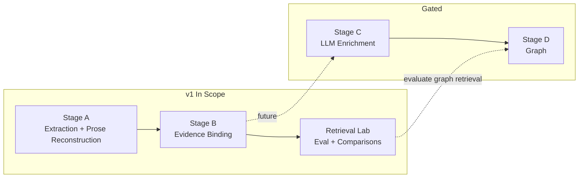

# Stage A/B v1 Architecture Overview

**Purpose:** Authoritative overview of the ingestion and retrieval pipeline up to Retrieval Lab. Stage C (enrichment) and Stage D (graph) are gated; they are not part of v1 baseline.

---

## 1. Stage Diagram

- **Stage A:** PDF/OCR → structural prose reconstruction (SurfaceAST, blocks). No semantics.
- **Stage B:** Stage A artifacts → EvidenceUnits (admissible, traceable). No ontology, no paraphrase.
- **Retrieval Lab:** Stage B substrate + query set → metrics (MRR, Recall@k, failure buckets). Comparative only; no authority or correctness.
- **Stage C (gated):** Enrichment over EvidenceUnits; non-authoritative; never alters EvidenceUnits.
- **Stage D (gated):** Graph construction from Stage C outputs; deterministic, versioned.

---

## 2. Artifact Flow and Boundaries

| Stage   | Input                    | Output                         | Consumer        |
|---------|--------------------------|--------------------------------|-----------------|
| A       | PDF pages, OCR output    | StageARecord, SurfaceAST       | Stage B only    |
| B       | Stage A outputs          | EvidenceUnits (JSON)           | Retrieval Lab, (future) Stage C |
| Retrieval Lab | EvidenceUnits + queries | Rankings, metrics, reports     | Humans, CI      |

- Stage A outputs are consumed by Stage B **only** through defined interfaces (schemas).
- Stage B outputs are consumed by Retrieval Lab **only** through the EvidenceUnit schema (and projections built from it).
- No hidden coupling: no corpus-specific logic in Stage B without explicit config.

---

## 3. Admissible Evidence vs Retrieval-Only Projections

- **Admissible evidence:** EvidenceUnits emitted by Stage B. They are the only canonical, citable evidence layer. Every fact in downstream systems must cite ≥1 EvidenceUnit.
- **Retrieval-only projections:** Clause families, context windows, graph-expanded units, or other derived views used **only** for retrieval (ranking, recall). They are not admissible; they must not be cited as evidence. See ADR-003.

---

## 4. Determinism Principles

- **Stage A:** Same input (page, model output) → byte-identical structural output when iteration order is fixed.
- **Stage B:** Same Stage A artifacts + config → byte-identical EvidenceUnits when all iteration uses stable sort keys (document_id, page, structural_path, ordering_key, unit_id).
- **Retrieval Lab:** Same corpus + config + embedding cache → identical rankings and metrics. Dedupe and merge use stable priority (EvidenceUnit over family anchor when both exist).

See [baseline_manifest.md](baseline_manifest.md) for environment fingerprint and determinism statements.

---

## 5. Where to Go Next

- **Stage A contract:** [stage_a_contract.md](stage_a_contract.md)
- **Stage B contract:** [stage_b_contract.md](stage_b_contract.md)
- **Retrieval Lab:** [retrieval_lab_v1.md](retrieval_lab_v1.md)
- **Schemas:** [schema_registry.md](schema_registry.md)
- **Terms:** [glossary.md](glossary.md)
- **Stage C/D gates:** [gates_stage_c_d.md](gates_stage_c_d.md)
